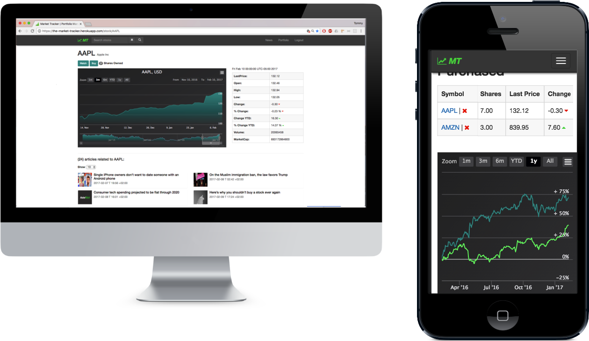

# Market Tracker

Check it out for yourself - [Market Tracker](#)!

Market Tracker enables users to simulate playing the stock market; lookup, view, and visualize stocks data, as well as research financial news.  

Log in or sign up to build a Portfolio by "Watching" and "Buying" stocks. Save a snapshot of their current market value, then compare later to see your simulated gains (or losses).

Inspired by [MarketWatch](http://www.marketwatch.com/).

## Why?

To demonstrate in a fun, usable way, the implementation of the  stack: MongoDB, Express, AngularJS, and Node.

## User stories

* As a user, I want to search by symbol or name and find a given stock's key stats.
* As a user, I want to save stocks I'm most interested in so I can view again later in one place.
* As a user, I want to simulate buying stocks and see how they're performing so I can see how I've done.
* As a user, I want to see feature-rich charts for single and multiple stocks at once.

## Key Technologies

* AngularJS
* Node: Express, Express-JWT, bcrypt
* MongoDB, Mongoose
* Bootstrap
* HTML, CSS, JavaScript
* APIs
  * [Markit On Demand API](http://dev.markitondemand.com/MODApis/)
  * [Highcharts API](http://www.highcharts.com/)
  * [News API](https://newsapi.org/)

## Challenges

### Integrating Stock API with Chart API
The Stock API response is robust but requires complex object inputs.  Additionally, transforming the response into usable data for the Chart API required multiple steps.  

Getting the Data.  We first entered the request URL in our browser to successfully obtain JSON data. Then we decoded the URL string to return a request object input which we could pass into our HTTP requests server-side. Hugely helpful here was URL to object decoding. With this object, we used Angular $http to hit our own controller API layer then the Stock API itself.

Converting the Data.  To identify the required data structures, we began by researching the Chart API documentation and looking into the examples they had.  We then began drawing out how the data would need to be manipulated and which parts were repeatable so that we could reuse these functions in our services component.

### Front and Back-End Data Processing
While instrumental to the security and function of our site, having front-end components and services, and a back-end API layer, proved to be challenging. We relied heavily on the promise and callback functions to ensure that had all functions processed fully before moving to the next.

Angular was extremely helpful in accomplishing front-end data manipulation and processing.  The component structure we used enabled us to use services and maintain our desired scope effectively.

MongoDB and Mongoose were especially fit for our data structures.  We were able to create schemas and populate our collections with related documents as necessary. This functionality was great for saving current stock data as a stock schema within the purchased schemas also including quantity and owner email for later retrieval.

### Responsiveness
A value in our site is the amount of data displayed; this makes responsiveness particularly challenging.  We ended up "freezing" the first column in our portfolio tables, ensuring the charts scaled to screen width, added a collapsing navigation bar, and created simple templates to ensure all views are viewed properly on mobile devices.

## In Progress

* Save and rewrite daily stock close values to reduce repeated stock API requests.
* Calculate and show in profile losses/gains since "purchasing" a stock.

## Contact  

Please feel free to reach out with any questions and/or comments!

### Tommy Lim
* [GitHub](https://github.com/Tommy-Lim)
* [LinkedIn](https://www.linkedin.com/in/tommy-lim)

### Christopher Whitaker
* [GitHub](https://github.com/1CTWgha)
* [LinkedIn](https://www.linkedin.com/in/christopher-whitaker-37528397)

## Market Tracker in Action

### Desktop and Mobile Friendly

